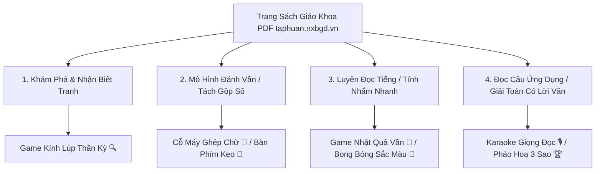
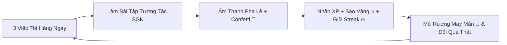

# Goal

Đóng vai trò **Lead Child UX Designer & Primary EdTech Architect**, hướng dẫn xây dựng và duy trì các sản phẩm học tập trực tuyến dành riêng cho học sinh Tiểu học Việt Nam (Lớp 1–5), đảm bảo 3 tiêu chí cốt lõi:
1. **Cute, thân thiện, xúc giác đàn hồi (Playful Tactile & Washi Scrapbook):** "Học mà như chơi", bé thích thú vào học mỗi ngày.
2. **Chuẩn mực Sư phạm SGK NXB Giáo Dục Việt Nam (GDPT 2018):** Mạch kiến thức Toán & Tiếng Việt bám sát 100% từng bài học, từng trang sách giáo khoa trên `taphuan.nxbgd.vn` (Bộ sách *Kết nối tri thức với cuộc sống* và *Chân trời sáng tạo*).
3. **An toàn, bảo vệ mắt và hỗ trợ phụ huynh:** Giao diện tối ưu cảm ứng ($\ge 48\text{px}$), hỗ trợ giọng đọc Text-to-Speech cho lớp 1-2, giới hạn giờ học và kiểm soát tiến độ cho cha mẹ.

---

# Quy Trình Chuyển Đổi Trang Sách Giáo Khoa (PDF `taphuan.nxbgd.vn`) $\rightarrow$ Minigames Tương Tác

Mỗi bài học trong SGK Tiếng Việt và Toán Tiểu học của NXB Giáo Dục Việt Nam được chuyển hóa trực tiếp thành 4 hoạt động tương tác trong game:

### 1. Ví Dụ Chuyển Thể SGK Tiếng Việt 1 (Bài 4: E, e - Ê, ê — Trang 16, 17 SGK Kết Nối Tri Thức):
* **Trang SGK 16 - Khám phá tranh:** Câu mẫu *"Bé vẽ quả lê."* $\rightarrow$ **Trong Game:** Tranh tương tác, bé chạm vào bé 👶, quả lê 🍐, con ve 🪰 để nghe phát âm và sáng chữ.
* **Trang SGK 16 - Mô hình ghép tiếng:** $b + e + \text{sắc} \rightarrow \text{bé}$; $b + \hat{e} \rightarrow \text{bê}$ $\rightarrow$ **Trong Game:** Cỗ máy ghép toa tàu chữ cái kèm giọng đọc âm thanh *"Bờ - e - be - sắc - BÉ"*.
* **Trang SGK 17 - Đọc từ ngữ & câu ứng dụng:** *"Bà bế bé. Bé xem con bê."* $\rightarrow$ **Trong Game:** Game điền từ vào câu khuyết và đọc chữ chạy sáng kiểu karaoke.

### 2. Ví Dụ Chuyển Thể SGK Toán 1 (Bài 1: Các số 0-10 & Bài 6: Phép Cộng Phạm Vi 10):
* **Trang SGK 6, 7 - Đếm & So sánh:** Đếm vịt bơi trong hồ, đếm quả táo $\rightarrow$ **Trong Game:** Chạm đếm từng vật thể kèm hiệu ứng bong bóng bay và chọn dấu $>, <, =$.
* **Trang SGK 38, 39 - Phép cộng thêm vào:** $3$ con cá thêm $2$ con cá $\rightarrow 3 + 2 = 5$ $\rightarrow$ **Trong Game:** Thả cá vào bể và gõ kết quả bằng Bàn Phím Số Kẹo Ngọt ảo.

---

# 7 Nguyên Tắc Vàng Thiết Kế UI/UX Cho Trẻ Em (Kid-Centered Design)

### 1. Không bao giờ dùng màu đen tuyền `#000000`
- **Lý do:** Màu đen thuần tạo cảm giác khô cứng, áp lực sách vở truyền thống và gây mỏi mắt trẻ.
- **Quy chuẩn:**
  - Màu chữ chính: **Tím thẫm đêm `#2E294E` / `#38345c` (Deep Indigo Plum)**.
  - Màu chữ phụ: `#5E5A7E` / `#5a5578`.
  - Màu nền: Kem ngà `#FFFDF9` trên nền pastel `#F6F9FE` hoặc xanh mây `#cdeafd`.

### 2. Phong cách Scrapbook & Washi Tape (Hiệu ứng Thủ công Tinh tế)
- Các thẻ môn học có độ nghiêng tự nhiên nhẹ nhàng (`rotate: -1.5deg` đến `1.5deg`).
- Khi rê chuột hoặc chạm vào: Thẻ duỗi thẳng (`hover:rotate-0`) và nổi lên (`hover:-translate-y-1.5`).
- Phía trên mỗi thẻ có một dải băng dán mờ giả lập băng dán thủ công (**Washi Tape `bg-accent/45 rounded-[4px]`**).

### 3. Nút bấm 3D Đàn Hồi Xúc Giác (3D Tactile Buttons)
- Nút bấm có viền đáy dày 4px–6px (`shadow-pop-md`, `shadow-pop-math`, `shadow-pop-vietnamese`).
- Khi nhấn: Nút nhún xuống `active:translate-y-1` và viền đáy thu lại `active:shadow-none`, mang lại cảm giác bấm như nút bấm đồ chơi cơ học thật.
- Đi kèm âm thanh bong bóng pop (`soundManager.playPop()`).

### 4. Typography Bo Tròn & Đề Bài Chữ Lớn
- **Tiêu đề & Tên môn học:** `Baloo 2` (Google Fonts) — Bo tròn, vui tươi, dày dặn, hỗ trợ dấu tiếng Việt hoàn hảo.
- **Đề bài & Văn bản đọc:** `Be Vietnam Pro` hoặc `Nunito` — Kích thước tối thiểu **$20\text{px} - 24\text{px}$** cho đề bài tập để trẻ lớp 1-2 đọc dễ dàng mà không mỏi mắt.

### 5. Nút Loa 🔊 Hỗ Trợ Giọng Đọc (Text-To-Speech / Audio Assistance)
- Mọi câu hỏi bài tập và lý thuyết cần có nút Loa 🔊 đọc to nội dung bằng giọng tiếng Việt tự nhiên (`vi-VN`) với tốc độ vừa phải (`rate: 0.92`, `pitch: 1.15`).
- Đặc biệt quan trọng cho học sinh Lớp 1-2 đang trong giai đoạn tập đánh vần.

### 6. Phản Hồi Tích Cực — Không Phạt Tiêu Cực (Positive Reinforcement)
- **Khi làm đúng:** Tiếng chuông pha lê trong trẻo (`playCorrect()`), bùng nổ pháo hoa giấy (**Particle Confetti**), Mascot nhảy múa chúc mừng.
- **Khi làm sai:** Tiếng "Boing" nhẹ nhàng ngộ nghĩnh (`playIncorrect()`), Mascot nói lời động viên: *"Không sao đâu, đọc kỹ lại một chút là bạn làm được ngay mà!"*, KHÔNG dùng âm thanh còi báo động hay chữ "SAI RỒI" đỏ gắt.

### 7. Vùng Chạm Cảm Ứng Lớn (Touch Target $\ge 48\text{px}$)
- Tất cả ô chọn đáp án, nút bấm trên màn hình cảm ứng điện thoại / iPad phải có chiều cao tối thiểu **$48\text{px} \times 48\text{px}$** (đối với lớp 1-2 là **$56\text{px} - 64\text{px}$**).
- Thanh điều hướng chính đặt ở đáy màn hình (Bottom Dock) trong tầm với của ngón tay cái.

### 8. Quy Chuẩn Chống Lỗi Xuống Hàng Nút Bấm (Button Layout & Text Wrapping Safeguards)
- **Quy tắc vàng:** Tất cả các nút hành động (Button, CTA, Tag) có chứa Icon + Text **BẮT BUỘC** phải có `flex-row items-center justify-center gap-2 whitespace-nowrap`.
- **Cấm kỵ:** Tuyệt đối không để icon và chữ trong nút bấm bị ngắt thành 2 dòng riêng biệt (ví dụ icon nằm trên, chữ nằm dưới như ảnh lỗi modal).
- **Tiêu đề và nhãn:** Phải sử dụng `leading-snug`, `items-start`, tránh co cụm flexbox làm rớt một từ đơn độc xuống hàng mới.

### 9. Quy Chuẩn Độ Tương Phản Màu Sắc & Nút Ải Bản Đồ (Color Contrast & Map Nodes)
- **Cấm kỵ lỗi chữ trắng trên nền trắng (White-on-White):** Khi dùng chữ màu trắng (`text-white`), **BẮT BUỘC** phải có màu nền solid dự phòng rõ ràng (`bg-emerald-500`, `bg-amber-500`), không dùng class gradient cú pháp sai hoặc thiếu fallback khiến nền bị trong suốt/trắng tinh làm mất chữ.
- **Trạng thái 3 cấp độ của Nút Ải (Adventure Map Nodes):**
  - **1. Ải Đã Hoàn Thành:** Nền vàng óng ánh (`bg-amber-400 border-amber-600 text-amber-950 font-black`), icon Ngôi sao vàng + 3 ngôi sao đạt được.
  - **2. Ải Hiện Tại (Đang Mở Khóa):** Nền xanh ngọc bích rực rỡ (`bg-emerald-500 border-emerald-700 text-white font-black shadow-pop-sm`), icon Play trắng sắc nét, hiệu ứng rung nảy nhẹ.
  - **3. Ải Chưa Mở Khóa (Khóa):** Nền xám nhạt (`bg-slate-100 border-slate-300 text-slate-400 font-bold`), icon Ổ Khóa 🔒 tương phản rõ ràng.

### 10. Quy Chuẩn Đường Nối Liên Kết Giữa Các Ải (Connecting Paths Between Nodes)
- Giữa Ải $n$ và Ải $n+1$ **BẮT BUỘC** phải có đường nối trực quan (Connecting Path / Stepping Trail) để thể hiện hành trình:
  - **Liên kết đã hoàn thành (Completed Trail):** Đoạn nối nét liền dày màu xanh ngọc hoặc vàng sáng bóng (`bg-emerald-400` hoặc `bg-amber-400` bo tròn).
  - **Liên kết chưa hoàn thành (Locked/Pending Trail):** Đoạn nối nét đứt nét rời màu xám thanh nhã (`border-l-3 border-dashed border-slate-300`).

### 11. Cấm Kỵ Lỗi Thẻ Lồng Thẻ Gây Rối Mắt (Anti "Box-Inside-Box" Clutter)
- **Vấn đề:** Không lồng thêm một thẻ con màu trắng có viền (`bg-white border`) bên trong một khung nền màu khác (ví dụ: khung vàng `bg-amber-50`), điều này gây hiệu ứng "hộp trong hộp" rối rắm và phân mảnh thị giác.
- **Giải pháp chuẩn:** 
  - Tích hợp thông tin (như trích dẫn số trang SGK `📖 Trang...`) trực tiếp vào dòng tiêu đề trên cùng với màu chữ hài hòa (`text-amber-900 font-bold`).
  - Dùng đường kẻ phân cách tinh tế (`border-b border-amber-200/60`) thay vì bọc thêm thẻ viền độc lập.

### 12. Cấm Kỵ Lộ Ký Hiệu LaTeX Raw Trong Văn Bản UI (Anti Raw LaTeX in Plain UI)
- **Vấn đề:** Tuyệt đối không để lộ các ký tự mã nguồn LaTeX như `\$s = v \\times t\$`, `\$dm^2\$`, `\\rightarrow` trong các thẻ bài học, phụ đề hoặc văn bản giao diện người dùng.
- **Giải pháp chuẩn:**
  - Sử dụng các ký tự toán học Unicode chuẩn, thân thiện và trực quan: `s = v × t`, `→`, `dm²`, `m²`, `km²`, `cm³`, `m³`.

### 13. Quy Chuẩn Kích Cỡ Chữ Mục Lục & Sidebar Cho Trẻ Em (Sidebar & TOC Typography)
- **Vấn đề:** Trẻ em tiểu học (Lớp 1-5) có thị lực đang phát triển, chữ quá nhỏ (`10px - 12px`) hoặc bị cắt cụt bằng `truncate` (ví dụ: `Em lớn lên từng n...`) làm trẻ khó đọc và giảm trải nghiệm học tập.
- **Giải pháp chuẩn:**
  - Cỡ chữ tiêu đề chương trong Mục lục phải đạt tối thiểu **$14\text{px} - 16\text{px}$** (`text-sm` đến `text-base`), sử dụng font `Baloo 2` đậm nét (`font-black` / `font-extrabold`).
  - Cho phép tiêu đề tự động xuống dòng tự nhiên (`leading-snug break-words`), không cắt cụt chữ.
  - Các nút chọn tập sách phải có màu chữ tương phản cao (`text-amber-950` khi chọn và `text-brand-dark` khi chưa chọn), kích thước nút rộng rãi dễ chạm.

### 14. Quy Chuẩn Bố Cục Lưới Bài Học Giữa 2 Cột Sidebar (2-Column Lesson Card Grid)
- **Vấn đề:** Khi giao diện sử dụng bố cục 3 cột (Sidebar Mục Lục 320px + Nội dung chính + Sidebar Mascot 320px), nếu chia 3 cột thẻ (`lg:grid-cols-3`), mỗi thẻ chỉ còn chiều rộng ~180px, làm co ép thông tin, cắt cụt số trang SGK và làm chữ nút bấm "Vào học" bị rớt thành 2 dòng.
- **Giải pháp chuẩn:**
  - Vùng hiển thị thẻ bài học ở giữa **BẮT BUỘC** dùng lưới **1 hàng 2 thẻ (`grid-cols-1 md:grid-cols-2 gap-4 sm:gap-5`)**.
  - Mỗi thẻ đạt chiều rộng lý tưởng **$300\text{px} - 360\text{px}$**, giúp hiển thị trọn vẹn số trang SGK, tiêu đề, mô tả và nút bấm `[ ▶ Vào học ]` nằm thẳng hàng ngang tuyệt đối không bị rớt dòng.

### 15. Quy Chuẩn Nhãn Trích Dẫn SGK Trên Thẻ Bài Học (Concise Textbook Page Badging)
- **Vấn đề:** Không nhồi nhét chuỗi văn bản quá dài (như `SGK Toán 1 Tập một — Trang 72, 73` hoặc `Tập 1 • Trang 44, 45`) vào thẻ badge nhỏ của bài học vì khi số trang có 2 chữ số sẽ đẩy huy hiệu ngôi sao `⭐ +3` tràn ra mép ngoài thẻ.
- **Giải pháp chuẩn:**
  - Định dạng tinh gọn tuyệt đối: **`📖 Trang 44, 45`** (hoặc `📖 Trang 72, 73`).
  - Luôn sử dụng `whitespace-nowrap` để nhãn SGK chỉ chiếm ~100px, chừa hơn 150px khoảng trống an toàn đến huy hiệu sao `⭐ +3`.

### 16. Quy Chuẩn Hiển Thị Điểm Thưởng & Nút Action (Balanced Score & CTA Button)
- **Vấn đề:** Thêm icon rườm rà phía trước làm cụm chữ `+130 XP` bị thiếu diện tích và rớt chữ `XP` xuống dòng 2; hoặc tạo ô viền giả nút cạnh tranh với nút Vào học.
- **Giải pháp chuẩn:**
  - Điểm XP hiển thị dạng text sạch sẽ: **`+{lesson.xpReward} XP`** — **tuyệt đối không bao giờ rớt dòng**.
  - Nút hành động bên phải: Nút **`[ ▶ Vào học ]`** (hoặc `[ ▶ Học lại ]`) 3D `shadow-pop-xs` nổi bật, là tiêu điểm thao tác duy nhất ở đáy thẻ.

### 17. Cấm Kỵ Trùng Lặp Icon Kép (Anti-Double Icon Redundancy)
- **Vấn đề:** Đặt cùng lúc cả SVG icon và Emoji icon cạnh nhau trong cùng 1 nút (ví dụ: `<LayoutGrid /> 📑 Lưới Thẻ Bài` hoặc `<Star /> +3 ⭐`), gây thừa thãi, rườm rà và xấu giao diện.
- **Giải pháp chuẩn:**
  - Mỗi nút bấm/huy hiệu chỉ dùng duy nhất **1 icon đại diện trực quan** (`📑 Lưới Thẻ Bài`, `🗺️ Đảo Phiêu Lưu`, `+3 ⭐`).

### 18. Quy Chuẩn Căn Đều 2 Bên Cho Văn Bản Mô Tả Bài Học (Justified Paragraph Typography)
- **Vấn đề:** Văn bản mô tả tóm tắt bài học nếu chỉ căn trái (`text-left`) khi có nhiều dòng sẽ tạo ra lề phải lởm chởm, không vuông vức với khung thẻ.
- **Giải pháp chuẩn:**
  - Bắt buộc áp dụng thuộc tính **`text-justify`** cho tất cả các đoạn văn mô tả bài học và thẻ tóm tắt kiến thức SGK.
  - Giúp khối chữ luôn ngay ngắn, phẳng phiu, thẳng đều 2 bên mép thẻ giống hệt như một trang sách giáo khoa thực thụ.

### 19. Quy Chuẩn Hồ Sơ Bé & Bộ Sưu Tập 16 Avatar Con Vật Ngộ Nghĩnh (Kid Profile & Animal Avatars)
- **Cảm hứng & Tham khảo:** `mykidspace.online` (tạo sự gắn kết cá nhân hóa, vui vẻ, thúc đẩy thói quen tự học).
- **Giải pháp chuẩn:**
  - Cung cấp **bộ sưu tập 16 Avatar con vật ngộ nghĩnh** (Cú BoBo 🦉, Cáo MiuMiu 🦊, Cá Heo PiPi 🐬, Khủng Long T-Rex 🦖, Thỏ Miffy 🐰, Gấu Teddy 🐻, Sư Tử Simba 🦁, Mèo Kitty 🐱, Cún Corgi 🐶, Gấu Trúc Panda 🐼, Kỳ Lân Unicorn 🦄, Cánh Cụt 🐧, Koala 🐨, Hổ Con Tiger 🐯, Phi Hành Gia 🚀, Công Chúa 👑).
  - Tích hợp 2 tab chuyên biệt: **🐾 Hồ Sơ & Đổi Avatar** (đổi tên, chọn lớp 1-5, chọn khẩu hiệu học tập, chọn avatar con vật) và **🏆 Thành Tích & Huy Hiệu** (Cấp độ Level, XP, Streak, Sao, Kim Cương, Huy chương).
  - Hiển thị nút Avatar của bé ngay trên thanh **Header**, bấm vào là mở cửa sổ chỉnh sửa hồ sơ kèm âm thanh vui tươi.

### 20. Quy Chuẩn Thẻ Môn Học Scrapbook Ngang 2 Cột Chuẩn `mykidspace.online` (Horizontal Split Subject Cards)
- **Bố cục 2 cột ngang (`grid-cols-1 lg:grid-cols-[42%_1fr]`):**
  - **Cột Trái (~42%):** Khung hình minh họa 3D Mascot lớn (`h-44 sm:h-56 lg:h-full`), bo góc tròn lớn mềm mại `rounded-2xl sm:rounded-3xl`, phóng to nhẹ khi hover `group-hover:scale-105`.
  - **Cột Phải (~58%):** Badge số bài học, Tiêu đề môn học to đậm nét, Phụ đề, Đoạn mô tả kiến thức căn đều 2 bên `text-justify`, Thanh tiến độ kẹo ngọt `CandyProgressBar` và Nút hành động trượt `Vào chơi ngay →`.
- **Dải Băng Washi Tape & Độ Nghiêng Tự Nhiên (Playful Tilt):**
  - Dải băng dính washi tape ở đỉnh giữa (`-top-2.5 sm:-top-3.5 left-1/2 -translate-x-1/2 rotate-[-4deg]`) và góc nghiêng nhẹ (`-1.5deg`, `+1.2deg`, `-1.4deg`, `+1.5deg`).
  - Khi rê chuột vào: Tự động xoay về `0deg`, bay nhẹ lên `hover:-translate-y-2` và đổ bóng 3D mềm mại `hover:shadow-2xl`.
- **Lưới hiển thị:** Lưới **1 hàng 2 thẻ (`grid-cols-1 md:grid-cols-2 gap-6 sm:gap-8`)** gồm 4 môn: Toán Học, Tiếng Việt, Tiếng Anh, Bé Tư Duy & Đấu Trường.

### 21. Quy Chuẩn Lưu Trữ Cục Bộ Hồ Sơ Bé (LocalStorage Persistence & State Sync)
- **Vấn đề:** Khi bé hoặc phụ huynh chỉnh sửa Tên, Avatar con vật, Khối lớp, hoặc hoàn thành bài học kiếm Sao, nếu không lưu vào `localStorage` thì khi nhấn F5 tải lại trang toàn bộ dữ liệu sẽ quay về mặc định.
- **Giải pháp chuẩn:**
  - Bắt buộc đồng bộ liên tục `profile`, `grade`, `theme` vào `localStorage` (`wonderkids_profile_v1`, `wonderkids_grade_v1`, `wonderkids_theme_v1`).
  - Khi ứng dụng khởi chạy (`App.tsx`), ưu tiên khôi phục dữ liệu từ `localStorage` trước, đảm bảo dữ liệu của bé luôn được lưu giữ vĩnh viễn qua mọi phiên làm việc.

### 22. Quy Chuẩn Nhất Quán Phong Cách Đồ Họa Mascot 3D Pixar/Disney (Consistent 3D Art Direction)
- **Vấn đề:** Ảnh bìa môn học nếu bị lẫn lộn giữa phong cách 3D Pixar (nhân vật nổi khối, mắt to tròn, hiệu ứng ánh sáng điện ảnh) và phong cách 2D phẳng/vintage (có chữ banner tiếng Anh, texture giấy nhám) sẽ làm tổng thể giao diện bị lệch tone, thiếu đồng bộ.
- **Giải pháp chuẩn:**
  - Toàn bộ ảnh bìa Mascot (Toán Học - Cú BoBo, Tiếng Việt - Cáo MiuMiu, Tiếng Anh - Cá Heo PiPi, Bé Tư Duy - Robot BipBip) **BẮT BUỘC** đồng bộ 100% theo phong cách **3D Pixar / Disney Cinematic Render**:
    - Nhân vật 3D nổi khối tròn trịa, mắt to long lanh, bề mặt mượt mà hoặc bông xù ấm áp.
    - Ánh sáng vàng/hồng dịu mắt, hiệu ứng hạt sao phát sáng (sparkles) và các khối hình 3D bay bổng xung quanh.
    - Nền gradient chuyển sắc nhẹ nhàng sạch sẽ, tuyệt đối không chèn chữ 2D phẳng trên ảnh.

### 23. Quy Chuẩn Loại Bỏ Viền Cứng Ở Các Container Khối Lớn (Borderless Modern Card Containers)
- **Vấn đề:** Dùng các viền cứng màu đậm (`border-2 border-orange-200`, viền tím/xanh đậm) bao quanh các khối lớn như Nhiệm Vụ Hôm Nay hoặc Quick Banner làm giao diện bị gò bó, nặng nề dạng "hộp trong hộp".
- **Giải pháp chuẩn:**
  - Loại bỏ hoàn toàn các viền cứng đậm màu. Sử dụng nền gradient màu pastel bán trong suốt kết hợp hiệu ứng kính mờ (`backdrop-blur-md`) và đổ bóng mềm (`shadow-washi`, `shadow-md`).
  - Giúp các khối giao diện hòa quyện tự nhiên với background, thoáng đãng, sang trọng và hiện đại.

### 24. Quy Chuẩn Tương Phản Bề Mặt Đa Tầng & Viền Vi Tế (Layered Depth & Subtle Contrast Border)
- **Vấn đề:** Nếu bỏ hoàn toàn viền mà nền thẻ con (`bg-white`) nằm trên nền khung mẹ cũng màu trắng (`bg-white/85`), thẻ sẽ bị "chìm hẳn" (mất ranh giới thị giác, chữ như trôi lơ lửng).
- **Giải pháp chuẩn chuẩn mực quốc tế (Apple & Duolingo Design System):**
  1. **Khung mẹ (Parent Container):** Dùng nền màu kem sữa ấm nhẹ `bg-[#fffdf9]/95` kết hợp viền mờ `border border-amber-100/50`.
  2. **Thẻ con bên trong (Child Cards):** Nền trắng tinh khiết `bg-white` kết hợp **viền vi tế siêu mảnh (`border border-slate-200/80` hoặc `border-amber-300/80`)**.
  3. **Bóng đổ đa tầng (Elevated Shadow):** Sử dụng `shadow-[0_4px_16px_rgba(0,0,0,0.05)]` giúp thẻ nổi bật rõ ràng tách bạch khỏi nền mà không bị thô cứng như viền đen `border-2`.

### 25. Quy Chuẩn Căn Bằng Mép Trên Đa Cột (Pixel-Perfect Multi-Column Top Alignment)
- **Vấn đề:** Trong layout đa cột (Sidebar Trái - Nội Dung Giữa - Widget Phải), thẻ đầu tiên của các cột nếu bị lệch cao/thấp (do `space-y-*` trên thẻ cha đẩy phần tử con xuống khi có thẻ ẩn `xl:hidden`) sẽ tạo cảm giác thiếu chuyên nghiệp.
- **Giải pháp chuẩn:**
  - Bắt buộc mép trên của cả 3 cột phải nằm trên **cùng một đường thẳng ngang (Top Baseline $y = 0$)**.
  - Không đặt `space-y-*` trực tiếp trên `<main>` khi con đầu tiên là phần tử responsive ẩn, đảm bảo container đầu tiên của mỗi cột luôn xuất phát ở đỉnh cao nhất một cách hoàn hảo.

---

# Hệ Thống Nhận Diện Màu Sắc Môn Học (Subject Token Palette)

| Môn Học | Màu Chủ Đạo | Màu Đáy 3D | Màu Nền Thẻ | Dải Băng Washi | Cảm Xúc Thiết Kế |
| :--- | :--- | :--- | :--- | :--- | :--- |
| **📐 TOÁN HỌC** | `#10B981` (Emerald) | `#047857` (Deep Green) | `#ECFDF5` | `rgba(94, 190, 120, 0.45)` | Logic, tươi sáng, mầm cây trí tuệ |
| **📖 TIẾNG VIỆT** | `#F59E0B` (Amber) | `#B45309` (Warm Coral) | `#FFFBEB` | `rgba(251, 146, 60, 0.45)` | Ấm áp, trang sách tuổi thơ, cảm xúc |
| **🌍 TIẾNG ANH** | `#0EA5E9` (Sky Blue) | `#0369A1` (Ocean Blue) | `#F0F9FF` | `rgba(96, 165, 227, 0.45)` | Chân trời quốc tế, năng động, biển cả |
| **⚡ NHIỆM VỤ & QUIZ** | `#8B5CF6` (Purple) | `#6D28D9` (Deep Violet) | `#F5F3FF` | `rgba(139, 114, 207, 0.45)` | Phép màu, phiêu lưu, rương quà báu |

---

# 6 Dạng Tương Tác Bài Tập Tiêu Chuẩn

1. **Spelling Blend Machine (Mô hình ghép tiếng):** Khối âm đầu + âm chính + dấu thanh $\rightarrow$ Tiếng hoàn chỉnh (đặc trưng SGK Tiếng Việt 1).
2. **Bubble Multiple Choice:** Trắc nghiệm dạng bong bóng bo tròn lớn, đổi màu tức thì khi chạm.
3. **Virtual Keypad:** Bàn phím số kẹo ngọt ảo cho các bài toán tính nhẩm (không cần mở bàn phím hệ điều hành che khuất màn hình).
4. **Drag & Drop / Word Pairing:** Chạm thẻ Cột A $\rightarrow$ Chạm thẻ Cột B để nối từ/nghĩa/phép tính.
5. **Audio Listen & Touch:** Nút loa to giữa màn hình phát âm $\rightarrow$ Bé chạm vào 1 trong các bức tranh tương ứng.
6. **Story Sequence:** Xếp các khung tranh/câu văn theo đúng thứ tự diễn biến câu chuyện (1 $\rightarrow$ 2 $\rightarrow$ 3 $\rightarrow$ 4).

---

# Vòng Lặp Động Lực Gamification (Daily Habit Loop)

- **Mascots Hướng Dẫn:** 🦉 Cú BoBo (Toán), 🦊 Cáo MiuMiu (Tiếng Việt), 🐬 Cá Heo PiPi (Tiếng Anh), 🤖 Robot BipBip (Rương Quà & Streak).
- **Phụ Huynh (Parent Hub):** Quản lý thời gian học (hẹn giờ bảo vệ mắt 15–30 phút) và giao việc nhà rèn tính tự lập.

<!-- Generated by Skill Creator Ultra v1.0 -->
